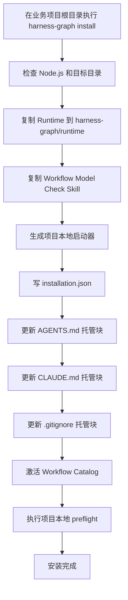
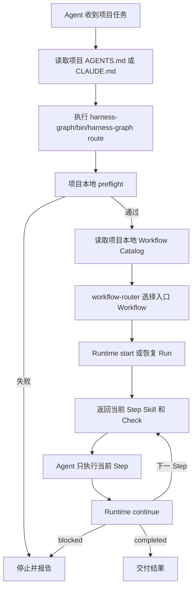

# Harness Graph 项目本地安装设计

## 目标

提供一个安装命令：

```bash
harness-graph install
```

命令将当前工作目录视为待开发项目根目录。安装完成后：

1. Harness Graph 的 Runtime、Workflow、Model、Check 和 Skill 全部随业务项目保存；
2. 所有 Harness 文件统一收口到项目根目录的 `harness-graph/`；
3. 用户可以直接修改、新增 Workflow、Skill、Check 和 Model；
4. 保留业务项目原有 `AGENTS.md` 和 `CLAUDE.md`；
5. Agent 每次收到项目任务时先进入项目本地 Workflow Router；
6. Runtime 状态不提交 Git；
7. Workflow 执行不依赖安装机器上的全局 Harness Graph 版本。

## 安装布局

安装后项目结构：

```text
business-project/
├── AGENTS.md
├── CLAUDE.md
├── .gitignore
├── .agents/
│   └── skills/harness-graph/SKILL.md   # Codex Adapter
├── .claude/
│   └── skills/harness-graph/SKILL.md   # Claude Code Adapter
├── package.json
├── src/
│
└── harness-graph/
    ├── bin/
    │   └── harness-graph
    │
    ├── runtime/
    │   ├── dist/
    │   │   └── cli.js
    │   ├── package.json
    │   ├── package-lock.json
    │   └── node_modules/              # 不提交
    │
    ├── workflows/
    │   ├── node-typescript-standards/
    │   │   ├── workflow.yaml
    │   │   └── STANDARDS.md
    │   ├── node-typescript-development/
    │   │   └── workflow.yaml
    │   └── node-project-configuration/
    │       └── workflow.yaml
    │
    ├── models/
    │   └── *.schema.json
    │
    ├── checks/
    │   └── */
    │       └── CHECK.md
    │
    ├── skills/
    │   └── */
    │       └── SKILL.md
    │
    ├── workflow-activation.yaml
    │
    ├── generated/
    │   └── workflow-catalog.json
    │
    ├── installation.json
    │
    └── .state/                        # 不提交
        ├── runs/
        └── tmp/
```

项目根目录只新增一个业务可见目录 `harness-graph/`，并在两个宿主约定目录中新增项目 Skill Adapter。`AGENTS.md`、`CLAUDE.md` 和 `.gitignore` 只插入安装器托管块，不替换文件。

`harness-graph/` 使用可见目录而非隐藏目录，因为 Workflow、Skill、Check 和 Model 是使用方需要持续维护、Review 和提交的项目资产。

`.agents/skills/harness-graph/SKILL.md` 与 `.claude/skills/harness-graph/SKILL.md` 内容相同，只加载 `harness-graph/skills/harness-graph/SKILL.md`。Adapter 由安装器管理，不是 Skill 事实源；已有同名但内容不同的文件或非文件路径时安装必须失败，禁止覆盖。

## Root 定义

正式区分以下路径：

| 名称 | 默认路径 | 职责 |
| --- | --- | --- |
| Project Root | 执行 `install` 的当前目录 | 业务项目、业务代码和项目开发规范 |
| Workspace Root | 与 Project Root 相同 | 当前 Workflow 实际修改和检查的目标项目 |
| Harness Root | `<project>/harness-graph` | Workflow、Skill、Check、Model 和 Catalog |
| Runtime Root | `<project>/harness-graph/runtime` | CLI 及运行依赖 |
| State Root | `<project>/harness-graph/.state` | Run、Lock 和临时输入 |

默认关系：

```text
Project Root = Workspace Root
Project Root/harness-graph = Harness Root
Harness Root/runtime = Runtime Root
Harness Root/.state = State Root
```

普通开发 Workflow 不通过业务 Input 决定 Workspace。`projectRoot` 只保留给“配置另一个项目”等确实需要独立目标目录的业务场景。

## 安装前与安装后命令

### 安装前

初次安装由临时 Bootstrap CLI 执行：

```bash
npx harness-graph install
```

当前未发布 npm 时支持：

```bash
node /path/to/harness-graph/dist/cli.js install
```

Bootstrap CLI 只负责把完整可运行载荷安装到当前目录。

### 安装后

所有项目任务统一调用项目本地命令：

```bash
./harness-graph/bin/harness-graph route
```

诊断命令：

```bash
./harness-graph/bin/harness-graph preflight
```

维护命令：

```bash
./harness-graph/bin/harness-graph activate
./harness-graph/bin/harness-graph validate workflows/example/workflow.yaml
```

Router 禁止调用业务项目的 `npm run workflow:start`、`npm run workflow:continue` 等 npm scripts。业务项目可能不是 npm 项目，也可能存在语义不同的同名脚本。

## 项目本地启动器

安装器生成：

```text
harness-graph/bin/harness-graph
```

启动器只负责定位同一安装目录内的 Runtime：

```bash
#!/usr/bin/env sh
set -eu

HARNESS_ROOT="$(CDPATH= cd -- "$(dirname -- "$0")/.." && pwd)"
exec node "$HARNESS_ROOT/runtime/dist/cli.js" "$@"
```

启动器必须满足：

- 不依赖机器绝对路径；
- 项目移动后仍有效；
- 项目 clone 到其他机器后仍能定位 Runtime；
- 不依赖全局 `harness-graph`；
- 不依赖业务项目 `package.json`；
- Node.js 版本要求继续为 22 及以上。

## Installation Manifest

安装清单位置：

```text
harness-graph/installation.json
```

当前结构：

```json
{
  "schemaVersion": 1,
  "layoutVersion": 2,
  "harnessVersion": "0.1.0",
  "installedAt": "2026-08-03T00:00:00.000Z",
  "runtime": {
    "version": "0.1.0",
    "hash": "<sha256>",
    "stateSchemaVersion": 1
  },
  "managedEntries": {
    "agents": true,
    "claude": true,
    "gitignore": true,
    "codexSkill": true,
    "claudeSkill": true
  }
}
```

安装清单不得保存机器绝对路径。所有路径根据项目本地启动器动态解析，保证项目可移动、可 clone。

`layoutVersion: 2` 表示 Harness Root、CLI 和项目 Skill 均使用 `harness-graph`。早期 `layoutVersion: 1` 使用 `harness-next/`；重复执行同一个 `install` 时，安装器迁移根目录、规范入口、两个宿主 Adapter、托管块和生产 Runtime，并将清单提升为 v2。迁移不覆盖用户维护的 Workflow、Skill、Check 或 Model。

## AGENTS.md 集成

### 已存在 AGENTS.md

安装器在文件顶部插入以下托管块：

```markdown
<!-- harness-graph:start version=1 -->
## Harness Graph

处理本项目的任何开发任务前，必须先执行：

`./harness-graph/bin/harness-graph route`

必须遵循 Runtime 返回的当前 Step，不得自行解析 Workflow、跳过 Check 或直接进入后续 Step。

`harness-graph/workflows/`、`harness-graph/models/`、`harness-graph/checks/` 和
`harness-graph/skills/` 是本项目维护的 Harness 事实源。

本文件其余项目开发规范继续有效。入口不可用、preflight 失败或 Workflow
进入 blocked 状态时，必须停止并报告，不得绕过 Harness Graph。
<!-- harness-graph:end -->
```

原文件内容必须逐字保留。

### 不存在 AGENTS.md

创建只包含托管块的文件。

### 重复安装

通过标记区间定位并替换托管块，不能重复追加。

### 异常规则

以下情况安装失败，不自动猜测：

- 文件中出现多个 Harness 托管块；
- 只有开始标记，没有结束标记；
- `AGENTS.md` 是目录；
- 文件无法读取或写入。

## CLAUDE.md 集成

采用与 `AGENTS.md` 相同的非破坏性托管策略，但分别维护，不能建立符号链接。

原因：

- 不同宿主的入口发现规则不同；
- 使用方可能在两份文件中维护不同规则；
- 符号链接会覆盖或混淆用户规则；
- 后续卸载需要独立恢复两份文件。

如果 `CLAUDE.md` 不存在，安装器创建只包含托管块的文件。

## .gitignore 集成

安装器插入托管块：

```gitignore
# harness-graph:start
harness-graph/runtime/node_modules/
harness-graph/.state/
# harness-graph:end
```

需要提交：

```text
harness-graph/bin/
harness-graph/runtime/dist/
harness-graph/runtime/package.json
harness-graph/runtime/package-lock.json
harness-graph/workflows/
harness-graph/models/
harness-graph/checks/
harness-graph/skills/
harness-graph/generated/workflow-catalog.json
harness-graph/workflow-activation.yaml
harness-graph/installation.json
.agents/skills/harness-graph/SKILL.md
.claude/skills/harness-graph/SKILL.md
```

不提交：

```text
harness-graph/runtime/node_modules/
harness-graph/.state/
```

## install 接口与行为

公开接口：

```bash
harness-graph install [target-directory]
```

默认：

```text
target-directory = process.cwd()
```

同一 Interface 同时处理首次安装、`layoutVersion: 1` 根目录迁移和当前安装的幂等确认，不增加 `upgrade` 或 `migrate` 命令。缺少清单时禁止根据目录猜测旧安装。

执行顺序：

1. 解析 Project Root；
2. 检查 Node.js 版本；
3. 检查目标路径可写；
4. 检查已有 Harness 安装状态；
5. 创建临时安装目录；
6. 复制 Runtime 构建产物，并从根 `package.json` 投影出只含生产依赖的 Runtime 包清单；
7. 复制默认 Workflow；
8. 复制 Model；
9. 复制 Check；
10. 复制 Skill；
11. 复制激活声明；
12. 生成项目本地启动器；
13. 生成 `installation.json`；
14. 检查并生成 Codex 与 Claude Code 项目 Skill Adapter；
15. 修改 `AGENTS.md` 托管块；
16. 修改 `CLAUDE.md` 托管块；
17. 修改 `.gitignore` 托管块；
18. 原子移动到 `harness-graph/`；
19. 生成 Workflow Catalog；
20. 执行一次 preflight；
21. 输出结构化结果。

输出示例：

```json
{
  "status": "installed",
  "changed": true,
  "projectRoot": ".",
  "harnessRoot": "harness-graph",
  "command": "./harness-graph/bin/harness-graph route"
}
```

## 安装载荷来源

安装器从当前 Harness Graph 发布包读取安装载荷，不能在多个模块重复维护文件清单。

源文件及目标位置：

| 源路径 | 目标路径 |
| --- | --- |
| `dist/` | `harness-graph/runtime/dist/` |
| `package.json` | `harness-graph/runtime/package.json` |
| `package-lock.json` | `harness-graph/runtime/package-lock.json` |
| `harness/workflows/` | `harness-graph/workflows/` |
| `harness/models/` | `harness-graph/models/` |
| `harness/checks/` | `harness-graph/checks/` |
| `harness/workflow-activation.yaml` | `harness-graph/workflow-activation.yaml` |
| `harness/generated/workflow-catalog.json` | `harness-graph/generated/workflow-catalog.json` |
| `harness/skills/` | `harness-graph/skills/` |

项目根目录中的两个宿主 Adapter 由安装器根据固定薄入口生成。它们只引用上表复制出的 `harness-graph/skills/harness-graph/SKILL.md`，不维护第二份 Workflow、Check 或 Step Skill 规则。

安装载荷不包含 Harness Graph 自身的开发入口和开发过程文件，例如：

- Harness Graph 自身的 `AGENTS.md`；
- `tests/`；
- `docs/superpowers/`；
- Harness Graph 自身 CI；
- TypeScript 源码和开发配置。

Runtime 包保留 CLI 运行时实际需要的生产依赖，不包含 `scripts`、`devDependencies` 或测试工具。安装器随后用 `npm install --package-lock-only --omit=dev` 生成专用生产 Lockfile；只有发生 Runtime 替换时才恢复 `node_modules`。

这些内容属于 Harness Graph 引擎开发，不属于使用方项目运行载荷。

## 幂等与冲突规则

### 相同安装重复执行

返回：

```json
{
  "status": "installed",
  "changed": false
}
```

不得：

- 重复插入托管块；
- 覆盖用户修改的 Workflow；
- 覆盖用户修改的 Skill；
- 清空 `.state/`；
- 修改业务项目其他文件。

### 早期 layoutVersion 1 安装

旧安装位于 `harness-next/` 时，`install` 执行布局迁移：

1. 校验旧清单、Runtime 内容哈希、托管块和 Runtime 必需文件；
2. 检查新旧 Harness Root、规范入口与两个宿主 Adapter 是否存在冲突；
3. 若存在运行中的 Run，停止并保留原安装；
4. 在项目内临时目录复制用户资产，将旧品牌路径转换为 `harness-graph`；
5. 重建当前生产 Runtime、启动器、Catalog 和 `layoutVersion: 2` 清单，并保留原 `installedAt`；
6. 写入新托管块和 Adapter，切换新 Root 后执行当前 preflight；
7. preflight 通过后移除旧 Adapter 和旧 Root，失败时回滚本次修改。

旧清单中的 `codexSkill` 和 `claudeSkill` 只有一个存在、目标路径内容不同或目标不是普通文件时，安装失败且不得产生部分修改。

### 已修改官方文件

如果用户已经修改：

```text
harness-graph/workflows/node-typescript-development/workflow.yaml
```

重复执行 `install` 时：

- 不覆盖；
- 不自动合并；
- 报告为项目本地维护内容；
- Workflow、Skill、Check 和 Model 仍由项目维护，`install` 只报告这些文件的差异，不覆盖用户修改；Runtime 属于安装器管理资产，会在清单哈希与当前发布 Runtime 不一致时由同一个 `install` 原子升级。

如果 Runtime 文件与清单记录的哈希也不一致，安装器会停止并报告 Runtime 已被本地修改，不覆盖该 Runtime。

### 缺失文件

- Runtime 必需文件缺失：安装失败并提示后续使用 `repair`；
- 用户可维护内容缺失：重复 `install` 不自动恢复，早期清单迁移所需的新增规范入口除外；
- 第一版不实现 `repair`，只报告问题。

## preflight 接口与行为

公开接口：

```bash
./harness-graph/bin/harness-graph preflight
```

检查：

1. 当前命令是否从项目本地 Runtime 执行；
2. 能否定位 Project Root；
3. `installation.json` 是否存在且版本受支持；
4. Runtime 文件是否完整；
5. `workflows/`、`models/`、`checks/`、`skills/` 是否存在；
6. 规范入口 Skill 和 Router Skill 是否存在；
7. `workflow-activation.yaml` 是否存在；
8. Catalog 是否存在且未过期；
9. `AGENTS.md` 托管块是否存在且唯一；
10. `CLAUDE.md` 托管块是否存在且唯一；
11. `.gitignore` 是否忽略 `.state/`；
12. `.state/` 是否可写；
13. Codex 与 Claude Code 项目 Skill Adapter 是否存在且内容未被修改；
14. 是否存在可恢复的 Run。

成功输出：

```json
{
  "status": "ready",
  "projectRoot": ".",
  "harnessRoot": "harness-graph"
}
```

失败返回非零退出码，不允许 Router 绕过。

## route 接口与行为

公开入口：

```bash
./harness-graph/bin/harness-graph route
```

固定执行顺序：

1. 内部执行 preflight；
2. 读取 `generated/workflow-catalog.json`；
3. 只从 `entryWorkflows` 路由；
4. 恢复已有 Run，或启动新 Run；
5. 只加载当前 Step 的 Skill 和 Check；
6. Runtime 返回 Transition；
7. 完成、阻塞或失败后输出结果。

CLI 不能替代 Agent 执行 Skill。`route` 的可执行部分负责 preflight、目录解析和 Runtime 调用；Router Skill 负责指导宿主 Agent 完成当前 Step。

第一版对“每次强制执行”的保证来自 `AGENTS.md` 和 `CLAUDE.md` 的托管入口，不提供宿主生命周期 Hook。

## Runtime 路径调整

现状从项目根读取：

```text
harness/workflows/
harness/models/
harness/checks/
harness/skills/
.harness/
```

调整后从 Harness Root 读取：

```text
workflows/
models/
checks/
skills/
generated/
workflow-activation.yaml
.state/
```

Runtime 内部路径模型：

```typescript
type HarnessPaths = {
  projectRoot: string;
  harnessRoot: string;
  stateRoot: string;
};
```

## Workflow 执行记录与摘要

Runtime 在每个 Run 的 `state.json` 中保存内部 `executionTrace`，记录实际发生的 Step 启动、Step Result、Transition 和最终状态。它是 Run 的执行证据，不是第二份 Workflow 定义；旧状态没有该字段时按空数组兼容读取。

执行摘要由 `src/workflow/report.ts` 从 Run 状态生成，项目本地 CLI 通过以下命令输出：

```bash
./harness-graph/bin/harness-graph report <run-id> --format markdown
```

报告包含 Workflow 名称、版本、哈希、实际 Step 顺序、尝试次数、Transition、Check 状态和最终状态。默认只保存结构化本地 Run 状态；Router 在 Workflow 成功完成且宿主支持交互时询问用户是否展示 Markdown 摘要。失败、阻塞或取消时直接输出必要摘要。Trace 和报告不得保存完整 Prompt、Secret 或完整命令输出。

职责分配：

- Compiler 使用 `harnessRoot`；
- Catalog 使用 `harnessRoot`；
- Runtime 状态使用 `stateRoot`；
- Workspace Check 使用 `projectRoot`；
- Harness Check 使用 `harnessRoot`。

## Check cwd 语义

保留现有声明：

```yaml
cwd: harness | workspace
```

调整后的含义：

| 值 | 执行目录 |
| --- | --- |
| `harness` | `<project>/harness-graph` |
| `workspace` | `<project>` |

运行 Runtime CLI 的 Check 应使用：

```yaml
commands:
  - command: node
    args:
      - runtime/dist/cli.js
      - project-check
    cwd: harness
```

禁止依赖业务项目 npm scripts。

## Workflow URI 与 Catalog 路径

继续使用：

```text
harness://models/<file>.schema.json
```

URI 固定解析到：

```text
<project>/harness-graph/models/<file>.schema.json
```

不修改 Open Workflow Specification，不引入第二套 Workflow 格式。

Workflow 路径统一相对 Harness Root：

```text
workflows/node-typescript-development/workflow.yaml
```

Catalog 中不得保存机器绝对路径。

## Router Skill 调整

`workflow-router` 当前依赖 Harness Graph 开发仓库中的 npm scripts。安装布局下需要删除：

```text
npm run workflow:activate
npm run workflow:start
npm run workflow:continue
```

改为项目本地命令：

```text
./harness-graph/bin/harness-graph preflight
./harness-graph/bin/harness-graph activate --check
./harness-graph/bin/harness-graph start ...
./harness-graph/bin/harness-graph continue ...
```

Router 必须：

- 读取使用方原有项目开发规范；
- 将项目规范作为当前任务约束；
- 不把 Harness Graph 自身的贡献规范应用到业务项目；
- 只读取当前 Step 的 Skill 和 Check；
- 不自行决定 Transition。

## 安装流程图



## 安装后任务流程



## MVP 范围

本次实现：

- `install`；
- `preflight`；
- 项目本地启动器；
- 单一 `harness-graph/` 安装布局；
- `AGENTS.md`、`CLAUDE.md`、`.gitignore` 托管块；
- Compiler、Catalog、Runtime、Check、Router 的路径适配；
- 幂等安装；
- 项目本地 Workflow 执行和恢复。
- `layoutVersion: 1` 的旧品牌目录迁移。

本次不实现：

- 远程 Registry 发布；
- 多版本升级；
- `repair`；
- `uninstall`；
- 宿主 Hook；
- 自动合并用户修改过的 Workflow；

## 实现计划

实现遵循 TDD，采用垂直切片，不先批量编写全部测试。

### Task 1：安装深 Module 与首次安装

**新增：**

```text
src/installation/installer.ts
```

建议公开 Interface：

```typescript
installHarnessProject(options)
checkHarnessProject(options)
resolveHarnessPaths(options)
```

行为测试：

```text
在空项目运行 install 后生成 harness-graph/，并生成可执行的项目本地入口。
```

最小实现内容：

- 解析 Project Root；
- 复制安装载荷；
- 创建启动器；
- 写入安装清单；
- 输出结构化结果。

### Task 2：保留项目规则

行为测试：

```text
已有 AGENTS.md 和 CLAUDE.md 时，install 保留原文并在顶部插入唯一入口块。
```

覆盖：

- 两个文件均存在；
- 只有一个存在；
- 两个都不存在；
- 损坏或重复托管块时拒绝修改。

### Task 3：幂等安装与 .gitignore

行为测试：

```text
连续运行两次 install，不重复入口块和忽略规则，也不覆盖 Workflow。
```

覆盖：

- 第二次安装 `changed: false`；
- 用户修改 Workflow 后不覆盖；
- `.state/` 和 Runtime 依赖被正确忽略；
- 用户原 `.gitignore` 内容逐字保留。

### Task 4：项目本地 preflight

行为测试：

```text
从业务项目执行项目本地 CLI，能够定位 Project Root、Harness Root 和 State Root。
```

覆盖：

- 安装清单版本；
- 目录完整性；
- Router 存在；
- Catalog 新鲜度；
- 托管块完整性；
- State Root 可写。

### Task 5：Catalog 和 Compiler 路径适配

行为测试：

```text
activate 从 harness-graph/workflows 读取，并写入 harness-graph/generated。
```

覆盖：

- Workflow 编译；
- Skill 和 Check 解析；
- `harness://models/` 解析；
- prerequisite；
- Catalog 中只保存相对路径。

### Task 6：Runtime 和 Check 路径适配

行为测试：

```text
Run 状态写入 harness-graph/.state/runs，Check 的 workspace cwd 指向业务项目。
```

覆盖：

- State Root；
- 单项目单活动 Run；
- Run 恢复；
- Workflow Hash 固化；
- `cwd: harness`；
- `cwd: workspace`；
- `HARNESS_WORKSPACE_ROOT`。

### Task 7：Router 项目本地执行

行为测试：

```text
Router 使用项目本地 CLI，不依赖业务项目 npm scripts。
```

覆盖：

- preflight 必须先执行；
- 只从 `entryWorkflows` 路由；
- 只加载当前 Step Skill 和 Check；
- Transition 继续由 Runtime 返回；
- blocked 时 fail closed。

### Task 8：文档与完整回归

更新：

- `README.md`；
- `docs/design.md`；
- `CONTRIBUTING.md`；
- `AGENTS.md` 中的路径约束和完成命令；
- `keywords.md` 中 Skill、Check、Model 的物理路径说明。

回归：

- Workflow 静态校验；
- Cycle；
- Input/Output Schema；
- Check；
- npm/Yarn/pnpm 项目检查；
- Catalog activation；
- Run 恢复；
- 单项目单 Run；
- Workflow Hash 固化。

## 主要代码改动

预计修改：

```text
src/cli.ts
src/workflow/compiler.ts
src/workflow/catalog.ts
src/workflow/runtime.ts
src/workflow/checks.ts
harness/skills/workflow-router/SKILL.md
README.md
docs/design.md
CONTRIBUTING.md
AGENTS.md
keywords.md
```

预计新增：

```text
src/installation/installer.ts
tests/installation.test.ts
```

现有 CLI、Compiler、Catalog、Runtime 和 Check 测试需要更新目录 fixture 和路径断言。

## 验收标准

在空临时项目中执行：

```bash
node /path/to/harness-graph/dist/cli.js install
```

安装后执行：

```bash
./harness-graph/bin/harness-graph preflight
./harness-graph/bin/harness-graph activate --check
./harness-graph/bin/harness-graph validate workflows/node-typescript-development/workflow.yaml
```

必须验证：

- 项目根只新增一个业务可见目录 `harness-graph/`；
- 原有 `AGENTS.md` 内容未丢失；
- 原有 `CLAUDE.md` 内容未丢失；
- 原有 `.gitignore` 内容未丢失；
- 第二次安装不产生重复内容；
- 早期 `layoutVersion: 1` 安装可由同一个 `install` 迁移到 `harness-graph/`；
- 用户修改 Workflow 后重复安装不覆盖；
- Workflow、Skill、Check、Model 都位于项目本地 `harness-graph/`；
- Catalog 从项目本地 Workflow 生成；
- Run 写入项目本地 `harness-graph/.state/`；
- Check 在正确的 Harness 或 Workspace 目录执行；
- Router 不依赖业务项目 npm scripts；
- 项目移动后本地启动器仍可工作；
- `npm run check:all` 全部通过；
- `npm run project:check` 全部通过；
- `npm run doctor` 全部通过；
- 三个现有 Workflow 全部通过 validate 和 image 检查。

## 风险与约束

| 风险 | 影响 | 处理方式 |
| --- | --- | --- |
| 安装器覆盖用户规则 | 丢失业务项目规范 | 只修改有版本标记的托管块，异常标记时停止 |
| 重复安装覆盖用户 Workflow | 丢失项目自定义流程 | install 只维护明确管理的 Runtime 和项目 Skill 入口，不修复或覆盖用户维护的 Workflow、Check、Model 和 Step Skill |
| 项目本地 Runtime 依赖无法恢复 | 新机器无法执行 | 提交 Runtime 构建产物和 Lockfile，忽略 node_modules |
| Catalog 与 Workflow 不一致 | Router 使用过期入口 | route 内部强制 preflight 和 activate --check |
| 业务项目同名 npm script | 执行错误命令 | Router 只调用项目本地启动器，不调用业务 npm scripts |
| 项目移动导致路径失效 | 本地命令不可用 | 启动器使用相对自身位置定位 Runtime，不保存绝对路径 |
| 宿主忽略 AGENTS.md/CLAUDE.md | Router 可被绕过 | MVP 明确只提供规则层强制，宿主 Hook 后续实现 |
| 可见安装目录被误删 | Harness 无法执行 | preflight fail closed，不自动猜测或静默恢复 |

## 设计决定

1. `harness-graph/` 是项目内可维护基础设施，不是只读缓存；
2. Workflow、Skill、Check、Model 与业务代码一起提交、Review 和回滚；
3. Runtime 构建产物随项目提交，运行依赖可由 Lockfile 恢复；
4. `AGENTS.md` 和 `CLAUDE.md` 保持使用方所有权，Harness 只拥有标记块；
5. Workspace 是 Runtime 上下文，不复制进所有 Workflow Input Schema；
6. State 与事实源同属一个顶层目录，但通过 `.state/` 和 `.gitignore` 隔离；
7. `install` 负责首次安装、同布局托管入口迁移、Runtime 生产包升级和幂等确认；目录布局升级、修复、卸载后续分别设计；
8. 继续只使用 Workflow、Step、Transition、Skill、Check 五个对外流程概念，安装布局不引入新的流程建模概念。
